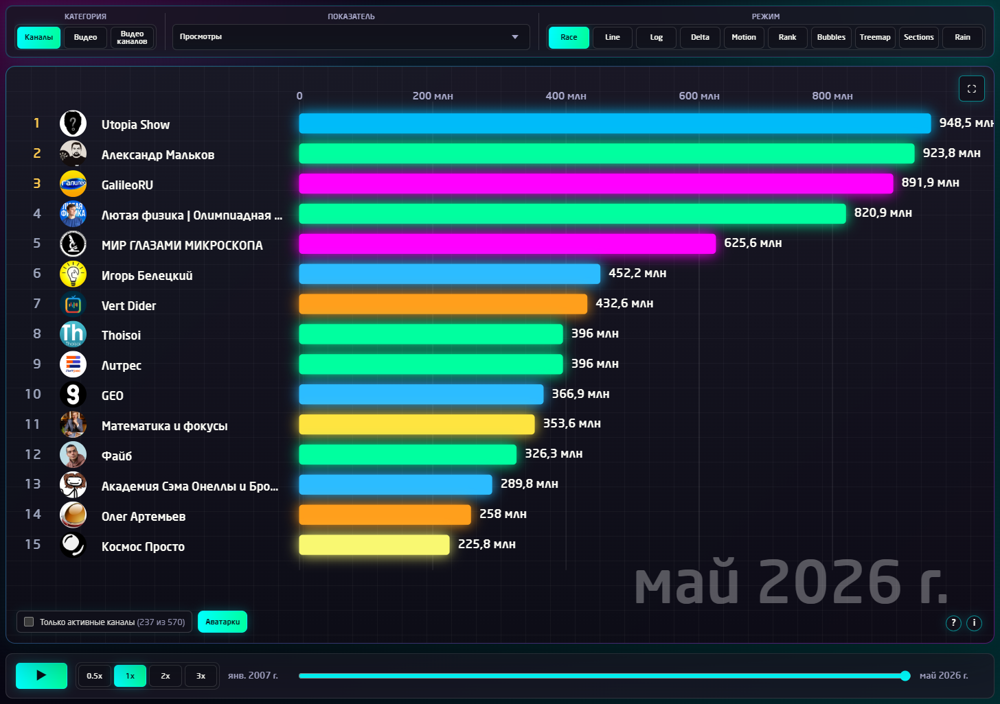
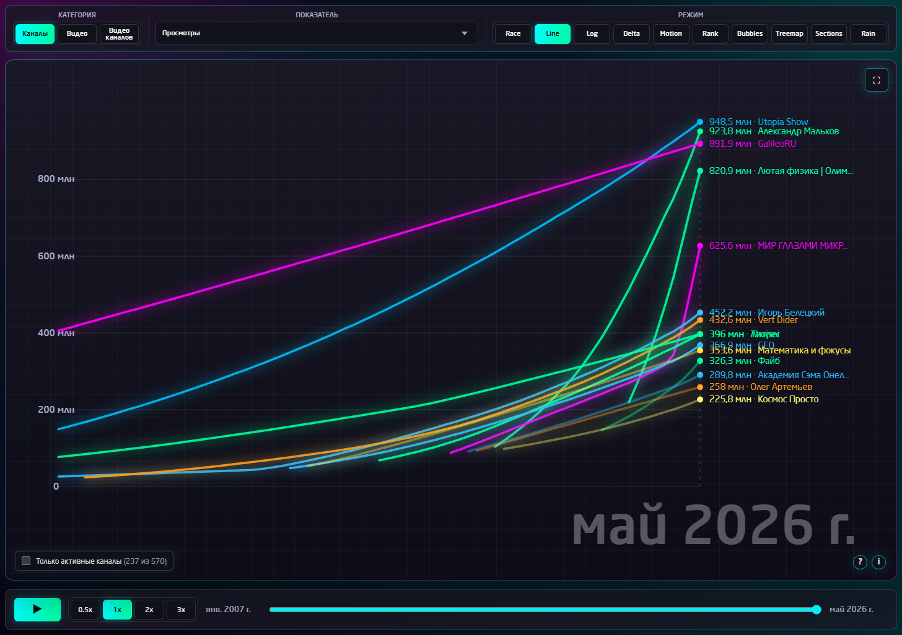
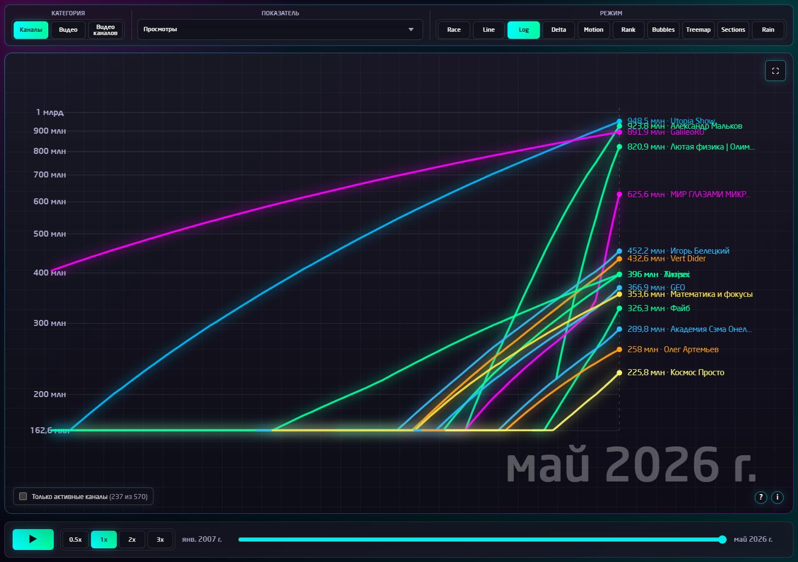
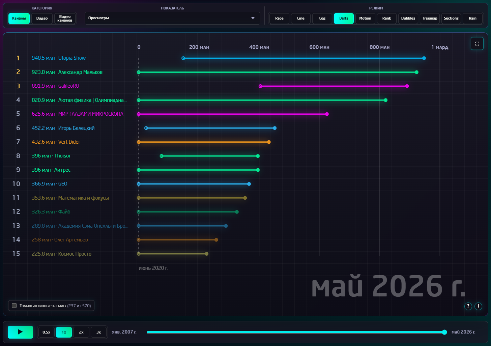
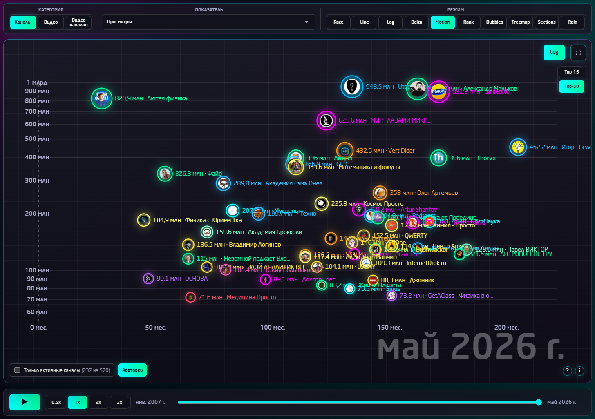
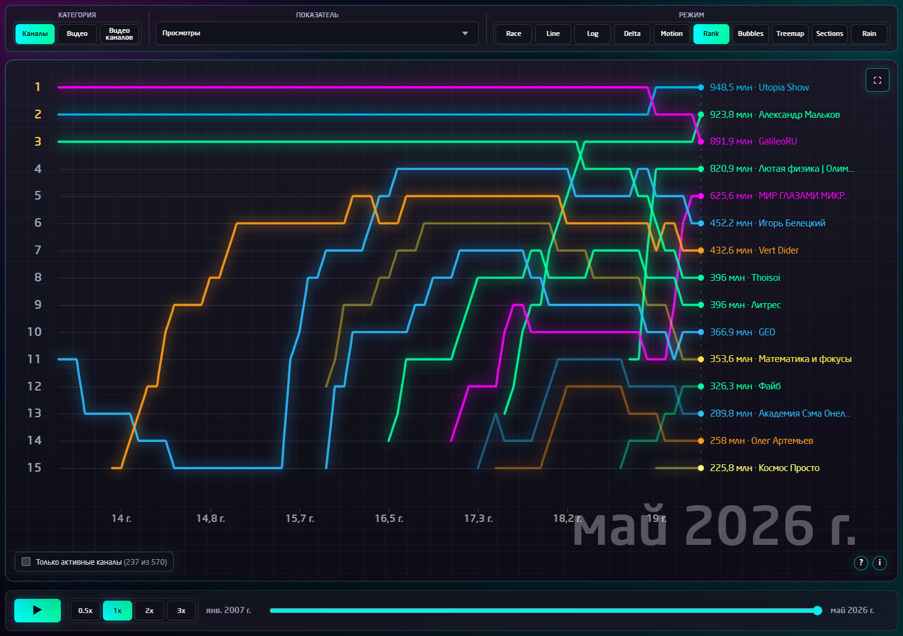
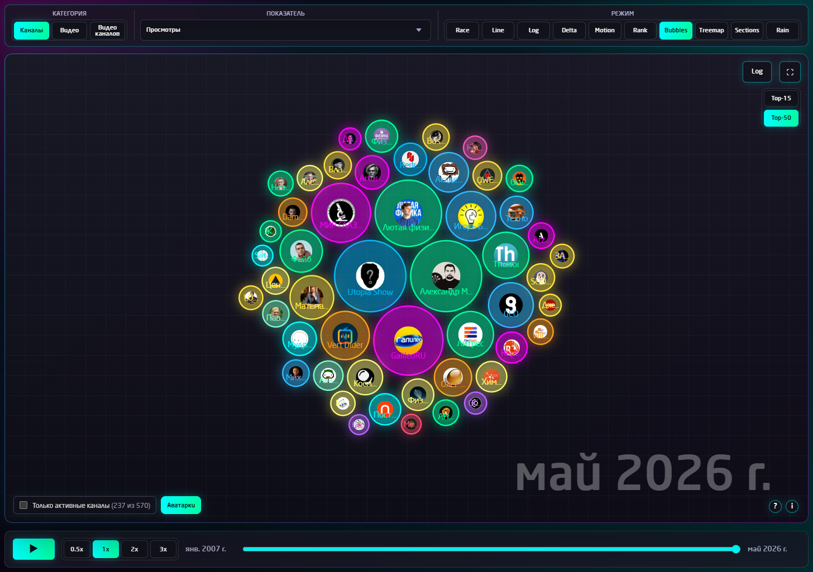
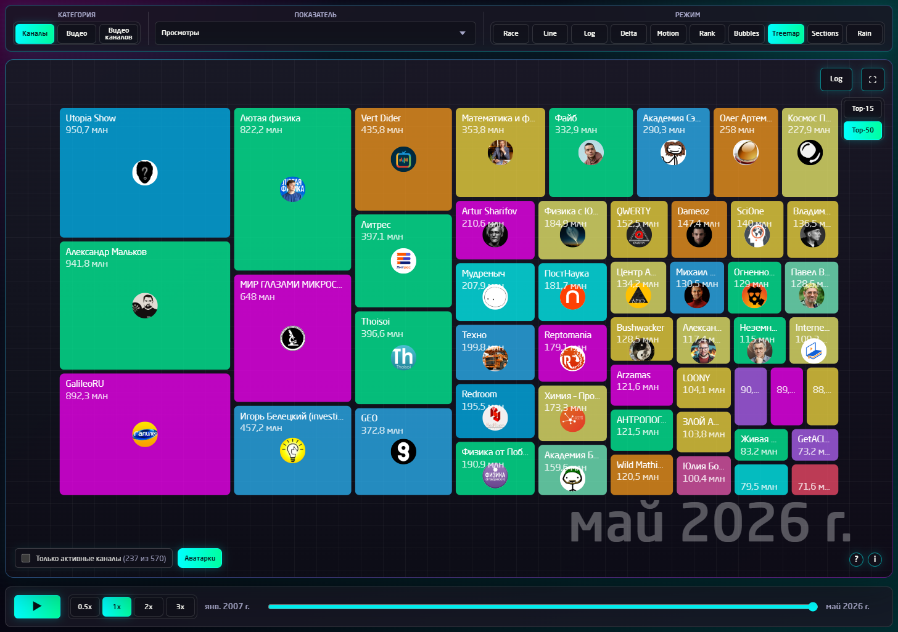
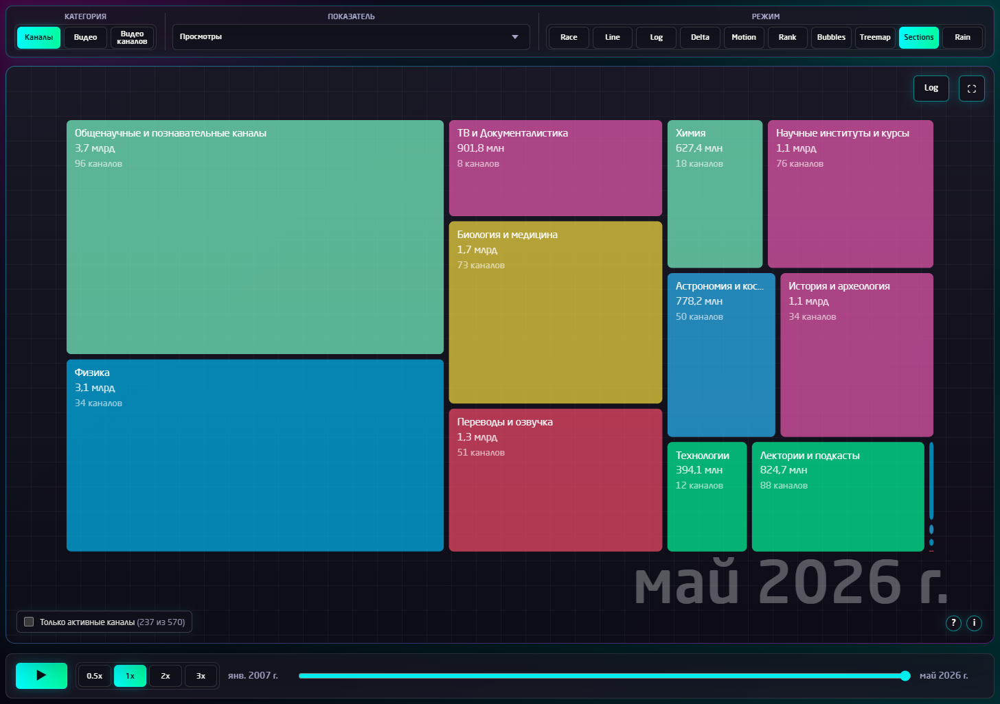
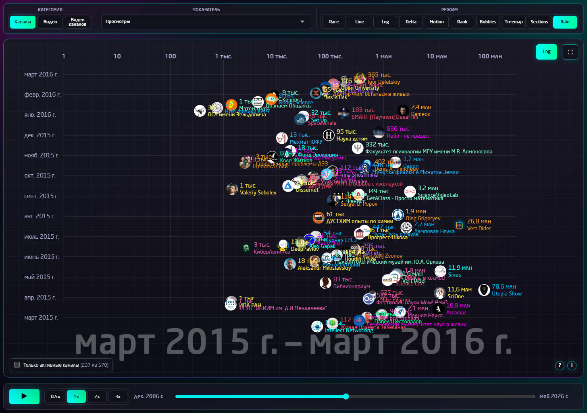

# SciTopus Dashboard

Интерактивная анимированная визуализация русскоязычного научно-популярного YouTube-сегмента SciTopus.

Открыть дашборд: [scitopus.com/youtube-dashboard#dashboard](https://scitopus.com/youtube-dashboard#dashboard)

## Что это

SciTopus Dashboard показывает, как менялись научно-популярные YouTube-каналы и видео во времени. Это не просто статичная таблица лидеров, а динамическая реконструкция: пользователь выбирает категорию, показатель и режим отображения, после чего видит, кто был заметен в конкретный момент и как менялось соотношение между участниками.

Дашборд помогает ответить на разные вопросы:

- какие каналы лидировали по просмотрам, подписчикам, комментариям или другим метрикам;
- какие видео были самыми заметными в конкретный период;
- как менялись позиции каналов и видео в топе;
- какие каналы оставались активными, а какие выпадали из динамики;
- как выглядит сегмент на линейной шкале, логарифмической шкале, в рейтинге, пузырьках, treemap и других формах.

## Источники и логика данных

Визуализация построена на объединении актуальной базы SciTopus и восстановленных исторических точек. Исторические значения для части каналов реконструируются по архивным данным, поэтому в интерфейсе используется формулировка "модельная реконструкция".

Для видео используется отдельная логика: в большинстве случаев неизвестно, сколько просмотров, лайков или комментариев было у ролика в каждый месяц после публикации. Поэтому значения распределяются от даты публикации к текущему известному значению как модельная траектория. Это позволяет сравнивать видео по динамике, не утверждая, что в каждом месяце было точно измеренное значение.

## Категории

### Каналы

Режим для сравнения YouTube-каналов. Он показывает динамику метрик каналов по времени: просмотры, подписчики, видео, комментарии, лайки и другие показатели, доступные в базе.

### Видео

Режим для сравнения отдельных видео по просмотрам, комментариям и лайкам. В этой категории важна дата публикации видео: она определяет момент появления объекта на временной шкале.

### Видео каналов

Режим для просмотра видео внутри выбранного канала. Пользователь выбирает канал из списка и затем смотрит его видео по просмотрам, комментариям или лайкам. Для тяжёлых режимов используется ограничение на количество элементов, чтобы интерфейс оставался читаемым и производительным.

## Основные элементы управления

### Категория

Переключает тип объектов: каналы, все видео или видео выбранного канала.

### Показатель

Определяет, какая метрика используется для расчёта и отображения: например просмотры, подписчики, комментарии или лайки. Визуализация в каждом режиме перестраивается под выбранный показатель.

### Режим

Выбирает способ визуализации. Режимы отличаются не оформлением, а самой логикой чтения данных: race показывает соревнование в моменте, line показывает траектории роста, rank показывает позиции, bubbles и treemap показывают структуру сегмента через площадь и размер.

### Play / Pause

Запускает и останавливает анимацию. Управление также продублировано пробелом и прокруткой по таймлайну.

### Скорость

Позволяет выбрать темп анимации: 0.5x, 1x, 2x или 3x.

### Таймлайн

Позволяет перематывать визуализацию к нужному месяцу. В конце анимации дашборд делает паузу, чтобы зритель успел рассмотреть финальное состояние.

### Логарифм

В режимах, где доступна логарифмическая шкала, кнопка Log помогает рассмотреть одновременно очень крупные и небольшие значения. Это важно для YouTube-данных, где лидеры могут отличаться от длинного хвоста на порядки.

### Top-15 / Top-50

В некоторых режимах можно переключать количество объектов на экране. Top-15 делает картину чище, Top-50 показывает больше участников и лучше раскрывает структуру сегмента.

### Только активные каналы

Фильтр оставляет каналы, которые были активны в последний год. Это помогает убрать неактивные объекты, если нужно смотреть именно живую часть сегмента.

### Аватарки и превью

В режимах, где используются изображения, можно включать и отключать аватарки каналов или превью видео. Это помогает выбирать между более узнаваемым и более чистым отображением.

## Режимы отображения

### 01. Race

Bar chart race. Режим показывает топ объектов в конкретный момент времени. Длина бара соответствует выбранному показателю, а вертикальная позиция показывает место в текущем топе. Этот режим лучше всего подходит для быстрого понимания, кто лидировал в конкретный период и как менялись лидеры.

Race использует паттерн bar chart race, который в начале работы сверялся с Observable-ноутбуком [Bar Chart Race / D3](https://observablehq.com/@d3/bar-chart-race) Майка Бостока. В этой версии логика, интерфейс, данные, анимации, переключатели, темы, дополнительные режимы и поведение шкал реализованы как кастомный SciTopus Dashboard, а не как прямой fork стороннего репозитория.

### 02. Line

Линейный режим. Каждая линия показывает изменение выбранного показателя во времени. В отличие от Race, здесь важна не только текущая позиция, но и вся траектория: когда объект появился, как быстро рос и насколько далеко ушёл от остальных.

### 03. Log

Логарифмическая версия линейного режима. Она нужна, когда значения отличаются на порядки: обычная шкала сжимает небольшие каналы в нижнюю область, а логарифм позволяет одновременно видеть лидеров и среднюю часть распределения.

### 04. Delta

Режим сравнения прироста и смещения внутри выбранного периода. Он помогает увидеть не только абсолютный размер, но и изменение относительно предыдущего состояния: кто ускоряется, кто теряет темп, кто меняет позицию.

### 05. Motion

Пузырьковая динамика. По горизонтали отображается возраст объекта или время с момента появления, по вертикали выбранное значение. Размер, цвет и подпись помогают читать распределение как карту сегмента: кто старый и крупный, кто молодой и быстро вырос, кто находится в плотной середине.

### 06. Rank

Режим траекторий позиций. Он показывает не столько значение, сколько место объекта в рейтинге. Это полезно, когда важно понять борьбу за позиции: кто поднимался, кто опускался, какие объекты стабильно держались в топе.

### 07. Bubbles

Packed bubbles. Каждый канал превращается в круг, размер которого зависит от выбранного показателя. Режим хорошо показывает структуру сегмента в моменте: насколько велик лидер, насколько плотная середина и есть ли выраженный длинный хвост.

### 08. Treemap

Treemap показывает те же отношения через площадь прямоугольников. Чем больше показатель, тем больше площадь блока. Такой режим удобен для чтения долей и концентрации: видно, занимает ли один канал значительную часть сегмента или распределение более равномерное.

### 09. Sections

Режим секций группирует каналы по категориям. Он показывает не только отдельных лидеров, но и распределение между тематическими блоками: где сосредоточены крупные каналы и какие направления занимают больше места.

### 10. Rain

Вертикальная "лента времени". На экране виден годовой отрезок, который движется как окно по общей временной полосе. Для каналов точка привязана к дате регистрации или старту активности, для видео - к дате публикации. Горизонтальная позиция показывает выбранный показатель.

## Комбинации отображения

Дашборд можно считать на нескольких уровнях детализации. Тема оформления не входит в расчёт: дневной и ночной режимы не считаются отдельными вариантами.

### Базовый уровень

- Каналы: 8 показателей x 10 режимов = 80 вариантов
- Видео: 3 показателя x 9 режимов = 27 вариантов
- Каналы + Видео = 107 вариантов
- Видео каналов: 570 каналов x 3 показателя x 9 режимов = 15 390 вариантов
- Все три категории = 15 497 вариантов

Итого базовая сетка даёт **15 497 вариантов отображения**.

### Расширенный уровень

Если добавить Top-50, логарифмические версии, лимиты Rain и фильтр "Только активные каналы", получается **33 000 вариантов отображения**.

Этот уровень показывает реальную вариативность интерфейса без учёта скорости воспроизведения и без учёта переключателей изображений.

### Полный уровень без темы

Если дополнительно учитывать:

- скорость воспроизведения: 0.5x, 1x, 2x, 3x;
- аватарки каналов;
- превью видео;
- комбинированные состояния аватарок и превью в режимах, где они доступны;

получается **283 816 вариантов отображения**.

Эта цифра не включает дневную и ночную тему как отдельные варианты.

## Что лежит в репозитории

Этот репозиторий содержит облегчённый кодовый пакет и презентационный набор для GitHub:

- `dashboard/index.html` - основной файл интерактивного дашборда;
- `dashboard/vendor` - локальные runtime-зависимости, нужные для работы HTML-версии;
- `dashboard/fonts` - шрифты интерфейса;
- `dashboard/assets` - статические ассеты, которые не являются тяжёлой базой данных;
- `dashboard/interactive_race_data/README.md` - описание исключённых production-данных и ожидаемой структуры;
- скриншоты режимов в папке `screenshots`;
- комбинированный 3x3-превью-файл `scitopus-dashboard-3x3-without-line.png`;
- описание логики дашборда и вариантов отображения.

Production-данные дашборда не включены в репозиторий. Полная рабочая версия находится на сайте SciTopus. Чтобы запустить локальную копию с реальными данными, нужно положить сгенерированную папку `interactive_race_data` рядом с `dashboard/index.html`.

## Атрибуция

Дашборд использует D3.js v7.9.0 как runtime-библиотеку для визуализации данных. Режим Race также указывает исходный референс по визуальному паттерну bar chart race. Подробные сведения о сторонних компонентах и лицензиях находятся в [`THIRD_PARTY_NOTICES.md`](THIRD_PARTY_NOTICES.md).

Репозиторий оформлен как самостоятельный проект, а не как GitHub fork: текущий дашборд включает существенно расширенную и переписанную реализацию с десятью режимами, собственными данными, темами, интерактивными фильтрами, таймлайном и отдельной логикой для каналов, видео и видео выбранного канала.
